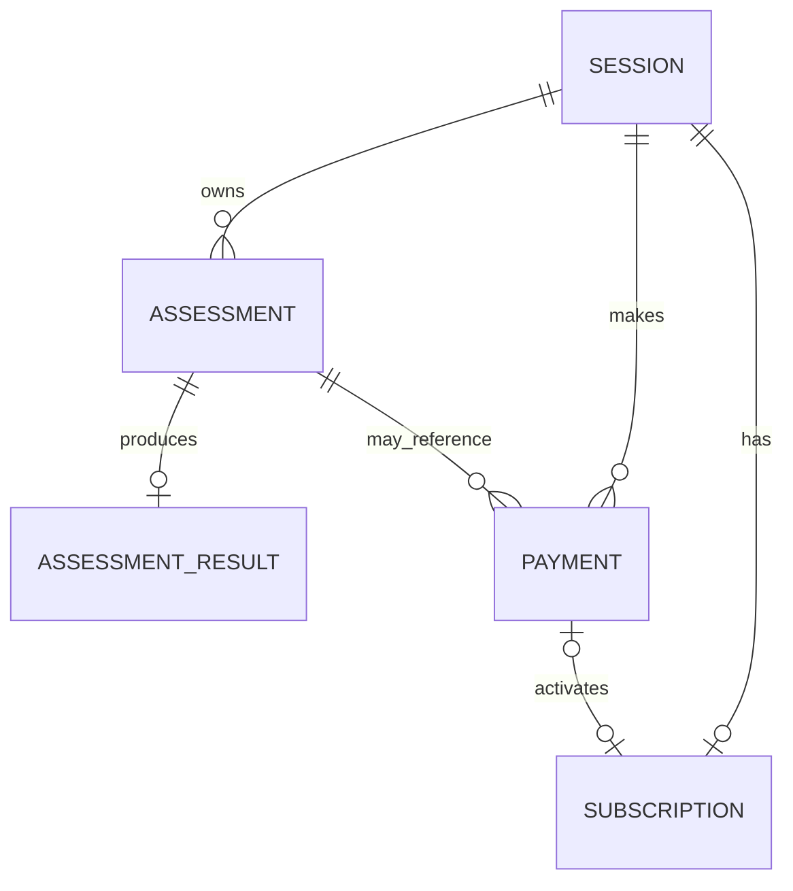
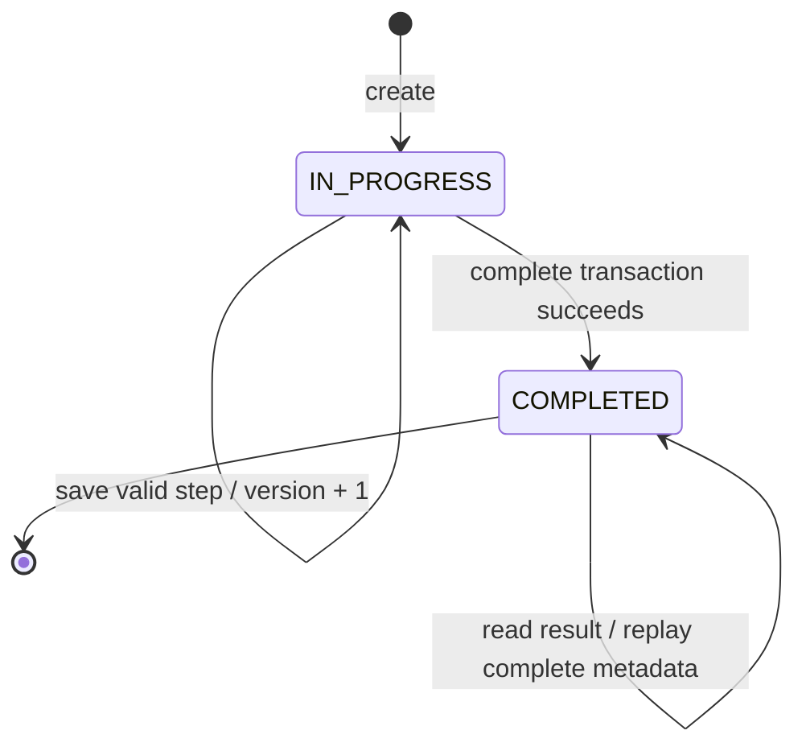
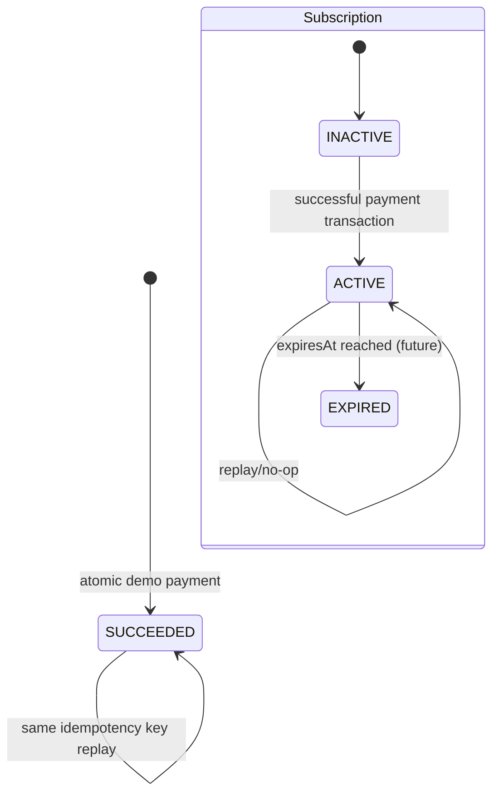

# 数据模型与状态规格

> 版本：v1.0 MVP Frozen

## 1. 建模目标

- 支持匿名用户多次测评，不把所有字段塞进用户表。
- 结果作为完成时快照持久化，避免公式变化导致历史结果漂移。
- 订阅与支付分离，保留状态变化和幂等审计能力。
- 对唯一性、并发和状态转换施加数据库级约束。

## 2. 核心实体

### Session

| 字段 | 说明 |
|---|---|
| `id` | 内部主键，不直接作为认证凭证 |
| `tokenHash` | 随机 token 的安全摘要，唯一索引 |
| `createdAt` / `updatedAt` | 审计时间 |
| `lastSeenAt` | 最近访问时间，可选 |
| `expiresAt` | Session 过期时间，默认创建后 30 天 |

Session 到期为绝对时间，不因访问更新；`lastSeenAt` 只用于审计。服务端收到过期 token 时视为未认证并清除 Cookie，不续期、不迁移旧 Assessment。

### Assessment

| 字段 | 说明 |
|---|---|
| `id` | 测评 ID |
| `sessionId` | 所属 Session 外键 |
| `status` | `IN_PROGRESS` / `COMPLETED` |
| `version` | 乐观锁版本号 |
| `ageRange` | 入口年龄分组 |
| `sex` | 计算用性别枚举 |
| `goal` | 减重/维持/增重 |
| `age` | 精确年龄 |
| `heightCm` | 统一公制 |
| `weightKg` | 当前体重 |
| `targetWeightKg` | 目标体重 |
| `activityLevel` | 活动水平枚举 |
| `completedAt` | 完成时间 |
| `createdAt` / `updatedAt` | 审计时间 |

MVP 冻结采用“宽表 + nullable 步骤字段”，因为问卷字段固定、时间有限、类型和查询清晰。不引入通用 EAV 答案表；未来题库动态化时另行评审 Question/Answer 模型。

### AssessmentResult

| 字段 | 说明 |
|---|---|
| `id` | 结果 ID |
| `assessmentId` | 一对一唯一外键 |
| `bmi` / `bmiCategory` | BMI 快照 |
| `bmrKcal` | 基础代谢快照 |
| `tdeeKcal` | 每日总消耗快照 |
| `recommendedCaloriesKcal` | 建议摄入快照 |
| `targetDate` | 预测日期，可为空（维持体重场景） |
| `calculationDate` | 完成事务采用的 UTC date-only 基准 |
| `estimatedWeeks` | 预计周数；维持体重为 0 |
| `predictionCurve` | JSON 预测点数组 |
| `calorieFloorApplied` | 是否实际触发 1200 kcal 下限 |
| `algorithmVersion` | 例如 `v1`，支持未来解释和迁移 |
| `createdAt` | 结果生成时间 |

### Subscription

| 字段 | 说明 |
|---|---|
| `id` | 订阅记录 |
| `sessionId` | MVP 权益归属 |
| `status` | `INACTIVE` / `ACTIVE` / `EXPIRED` |
| `activatedAt` / `expiresAt` | 生效与到期时间 |
| `activationPaymentId` | 首次激活 Payment 的可空唯一外键；INACTIVE 时为空 |
| `updatedAt` | 状态更新时间 |

### Payment

| 字段 | 说明 |
|---|---|
| `id` | 支付事件 ID |
| `sessionId` | 支付发起方 |
| `assessmentId` | 演示中触发解锁的已完成测评，P0 必填 |
| `status` | `PENDING` / `SUCCEEDED` / `FAILED` |
| `provider` | 固定 `DEMO` |
| `idempotencyKey` | 唯一键，防重复处理 |
| `requestFingerprint` | 幂等请求指纹；MVP 由规范化 `assessmentId` 生成 |
| `transactionId` | 模拟交易号，唯一 |
| `paidAt` / `createdAt` | 审计时间 |

## 3. 关系

## 4. Assessment 状态机

规则：

- `IN_PROGRESS` 可修改，版本号每次有效变更递增。
- `COMPLETED` 不可修改；原结果不可被覆盖。
- 重新测评创建新 Assessment。
- 仅当结果创建成功后才能将状态设为 `COMPLETED`。
- 每个 Session 最多一个 `IN_PROGRESS`；重复创建返回现有记录。

## 5. Payment 与 Subscription 状态机

图中是 MVP 实际状态路径。`PENDING`、`FAILED` 和 `EXPIRED` 可保留在 Schema 作为未来扩展枚举，但 MVP 服务不得产生这些状态。

Payment 成功写入与 Subscription 激活必须处于同一事务，避免“扣款成功但未解锁”式的不一致。Demo provider 为同步成功模型：MVP 只持久化 `SUCCEEDED`，校验失败不建 Payment，事务失败不留 Payment；`PENDING`/`FAILED` 是未来扩展状态。

Subscription 是 Session 级权益：`ACTIVE` 时可读取该 Session 下所有已完成 Assessment 的 Full Result。`assessmentId` 只记录支付从哪个结果页发起，不限定权益范围。MVP 的 `ACTIVE` 为永久 Demo 权益，`expiresAt = null`；`EXPIRED` 不会由 MVP 业务产生。

## 6. 数据约束

- `Session.tokenHash` 唯一。
- `AssessmentResult.assessmentId` 唯一。
- `Payment(sessionId, idempotencyKey)` 复合唯一，`transactionId` 全局唯一；严禁将 `idempotencyKey` 单列设为全局唯一或按键查询后跨 Session 返回数据。
- 一个 Session 只允许一条用于首次激活的成功 Payment：Subscription 激活时必须写入唯一 `activationPaymentId`，并用 PostgreSQL 针对 `status = 'SUCCEEDED'` 的部分唯一索引双重兜底。
- MVP 每个 Session 至多一个 Subscription。
- 新建 Session 时必须在同一事务创建唯一 `INACTIVE` Subscription；支付锁定该已存在行，不在并发支付事务中临时竞争创建。
- PostgreSQL 部分唯一索引保证每个 `sessionId` 至多一个 `status = 'IN_PROGRESS'` 的 Assessment。
- 枚举使用数据库或 Prisma 枚举，不存任意字符串。
- 数值字段使用适合精度的 Decimal/Numeric，不用字符串保存。
- 应用层 Zod 负责友好错误；数据库约束作为最后防线。
- 删除策略优先 `Restrict`/显式清理，不使用未经评估的级联删除。

## 7. 进度推导

进度由必填字段是否存在且仍然有效推导，而不是只信任一个可漂移的 `currentStep` 字段。可返回：

- `completedSteps`：按固定问卷顺序计算，只包含非空且有效的步骤。
- `nextStep`：第一处缺失或失效的必填项。
- `progressPercent`：已完成步骤数 / 8。

如为查询性能保存 `currentStep`，它只能是可重建缓存，需在同一事务更新。

## 8. 并发与幂等

- 客户端保存时提交 `version`。
- 更新条件包含 `id + sessionId + version + IN_PROGRESS`。
- 成功时 `version + 1`；更新行数为 0 时重新判定 404/409。
- 相同值的重放可视为幂等成功，但需要返回当前版本。
- 相同值指规范化后的领域值相同且不会触发新的下游失效；该判定优先于版本检查且不递增版本。不同值仍必须匹配当前版本。
- 依赖前置字段缺失的乱序答案不落库：`age` 依赖 `ageRange`；`targetWeightKg` 依赖 `goal`、`heightCm`、`weightKg`。
- 保存 `ageRange` 时在同一事务重新校验 `age`；保存 `goal/height/weight` 时重新校验 `targetWeight`，失效值置空并递增同一个版本。
- `complete` 必须携带版本，由 `id + sessionId + version + IN_PROGRESS` 条件更新、结果唯一约束和事务共同防止过期计算与重复结果。
- `pay` 除 Session 内幂等键唯一约束外，还必须对同一 Session 的 Subscription 行执行可串行化更新或等价锁定，防止不同幂等键并发产生两次首次成功支付。相同键不同 `requestFingerprint` 返回冲突。

## 9. 数据生命周期与隐私

MVP 不实现自助删除，入口和 README 必须说明仅用于演示、建议使用非真实数据。普通 Session 创建 30 天后失效；失效 Session 及其 Assessment、Result、Subscription、Payment 最迟再保留 7 天后由版本化 `data:purge-expired` 脚本按显式事务顺序删除。公开演示期间发布值守人至少每 7 天执行一次 dry-run 与正式清理，评审结束后再执行一次；清理数量、时间和结果只记审计汇总，不记录健康字段。日志不得记录 Cookie、token 原文和完整请求体。若未来公开运营，需要补充：用户自助删除、同意记录、隐私政策版本和地区合规评估。

### 9.1 历史数据与兼容

- 本项目为 Greenfield MVP，首发时没有存量用户或历史生产数据。
- 所有 Schema 变更使用可审阅的向前迁移；禁止部署启动时执行 `db push` 覆盖线上结构。
- Result 保存 `algorithmVersion`，新算法只影响新 Result，不静默重算历史结果。
- 新增字段优先 nullable 或带安全默认值，采用“先扩展、部署兼容代码、再收紧约束”的迁移顺序。
- Seed 数据通过版本化脚本重建，不把人工修改的演示数据库视为可信源。
- 发生不兼容迁移时，优先回滚应用并保留数据库；数据库回退必须使用经过验证的补偿迁移，不执行破坏性 reset。

## 10. 验收

- ER 图与 Prisma Schema 一致。
- 所有唯一约束、索引和外键通过迁移创建。
- 并发保存只能有一个请求按旧版本成功。
- 完成事务失败时 Assessment 仍为 `IN_PROGRESS` 且无孤立 Result。
- 支付事务失败时不会出现 Payment 成功但 Subscription 未激活。
- 数据库约束证明每个 Session 最多一个进行中测评、一个 Subscription 和一个首次成功 Payment。
- 两个 Session 使用相同幂等键互不影响；任何响应均不泄露另一 Session 的 Payment。
- 旧 `algorithmVersion` Result 在新版本部署后仍能按原快照读取。
- 向前迁移可在空库和上一版本 Schema 上各执行一次并通过验证。
- 过期清理脚本的 dry-run、跨实体删除顺序、未到期数据保留和重复执行幂等均在测试库验证。
